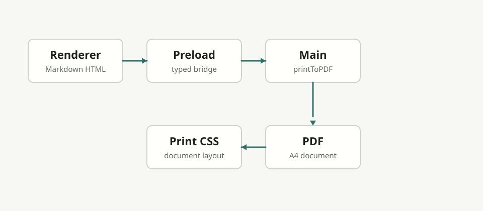

# Mora Markdown Showcase

This document is a development sample for checking Mora's Markdown rendering, typography, spacing, code highlighting, and table behavior.

## Paragraphs

Mora is a minimal, local-first Markdown editor. The preview should feel calm, readable, and content-first, even when paragraphs become long enough to wrap across several lines in the reading column.

中文段落用于检查字体、行高和段落间距。Mora 应该在中文、英文和数字混排时保持清晰，例如 Markdown editor 0.2 should feel quiet and comfortable.

### Inline Formatting

Use **bold text** for emphasis, *italic text* for a softer note, and ~~strikethrough~~ for removed ideas. Inline commands such as `pnpm dev`, `Ctrl+S`, and `window.mora` should remain compact and readable.

#### Links

Visit [OpenAI](https://openai.com) or read the [Electron documentation](https://www.electronjs.org/docs/latest/) for related platform details.

##### Image




###### Small Heading

Small headings should be visible without shouting.

---

## Blockquote

> Mora is a minimal Markdown editor that keeps attention on the document.
>
> Nested paragraphs inside quotes should stay readable without becoming a card.

## Lists

- Write Markdown
- Preview the rendered document
- Save local files
  - Keep UTF-8 text
  - Preserve a quiet interface
- Return to writing

1. Open a document
2. Edit content
3. Save changes
4. Read in Preview mode

## Task List

- [x] Build the first editing flow
- [x] Add live preview
- [ ] Polish PDF export in a later milestone
- [ ] Add more automated tests

## Table

| Name | Description | Status |
| --- | --- | --- |
| Editor | CodeMirror Markdown input | Ready |
| Preview | Sanitized markdown-it rendering | Ready |
| PDF Export | Future V0.3 feature | Not started |

| Long Column | Description With Wrapping | Notes |
| --- | --- | --- |
| Very wide table content | This cell intentionally contains a long sentence that should wrap inside the PDF page instead of forcing the document wider than A4. | Tables should stay readable when exported. |
| Local image support | Relative image paths such as `./assets/mora-architecture.svg` are important for technical notes. | PDF export should use the Markdown file location as the base path. |

## TypeScript

```ts
type ViewMode = 'editor' | 'split' | 'preview'

function titleFor(fileName: string, dirty: boolean): string {
  return `${fileName}${dirty ? ' *' : ''} - Mora`
}
```

## Long Code Line

```ts
const veryLongConfigurationValue = "mora-pdf-export-keeps-long-code-lines-inside-the-page-without-forcing-horizontal-document-overflow-or-clipping-important-technical-content";
```

## Python

```python
def count_words(text: str) -> int:
    return len(text.split())

print(count_words("quiet markdown editor"))
```

## C++

```cpp
#include <iostream>

int main() {
    std::cout << "Mora" << std::endl;
    return 0;
}
```

## JSON

```json
{
  "name": "mora",
  "version": "0.2.0",
  "focus": "beautiful markdown editing"
}
```

## Long Paragraph

Readable software starts with small decisions repeated consistently: moderate line length, predictable spacing, muted borders, low-friction controls, and typography that lets the document breathe. A Markdown editor should feel like a place to think, not a dashboard competing for attention.

## 多页中文内容

中文标题和正文用于检查 PDF 导出时的字体回退、字符间距和中英文混排。Mora V0.3 的 PDF 导出应该保持白底、清晰正文、合理页边距，并且在标题、段落、代码块、表格和图片之间形成稳定的阅读节奏。

### Additional Section One

This section adds enough content to exercise page breaks. Headings should not be left alone at the bottom of a page, while normal paragraphs can flow naturally from one page to the next.

### Additional Section Two

> A short quote near a page boundary should remain visually connected and readable. The left border should print clearly without becoming heavy.

### Additional Section Three

- PDF output should include only document content.
- Toolbar and editor chrome should never appear in the exported file.
- Unsaved editor content should be exported from memory.
- Exporting PDF should not save the Markdown source file.

### Additional Section Four

Another paragraph keeps the sample long enough for multi-page PDF checks. The exact page count depends on platform fonts and Chromium layout, but this file should generally produce more than a single page after export.
